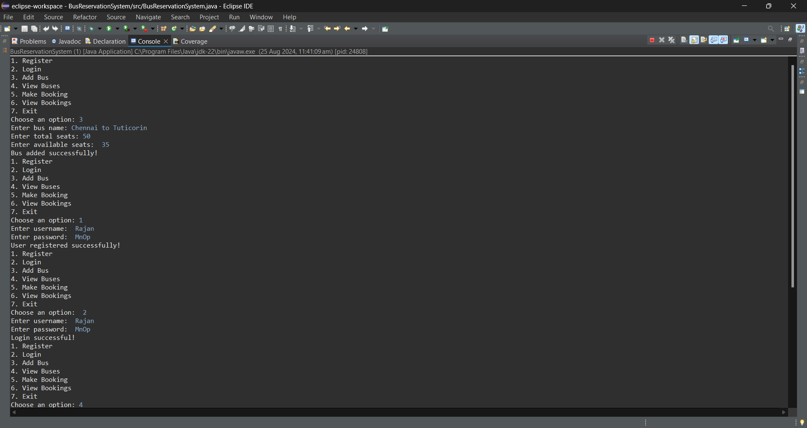
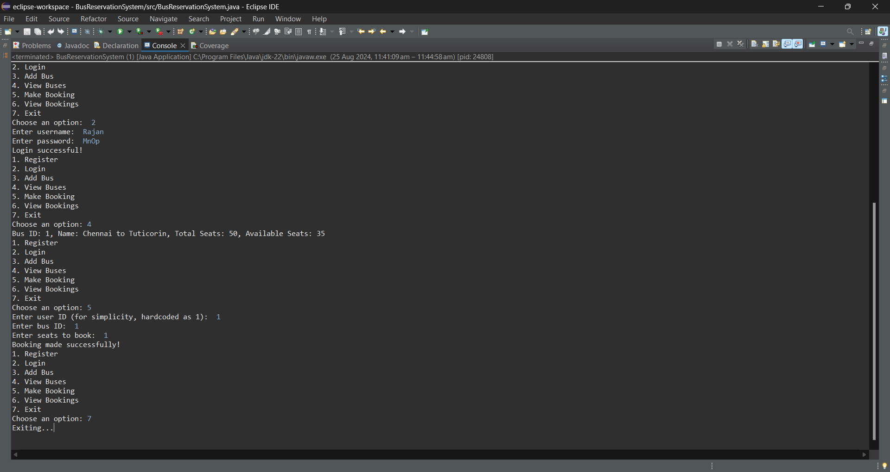
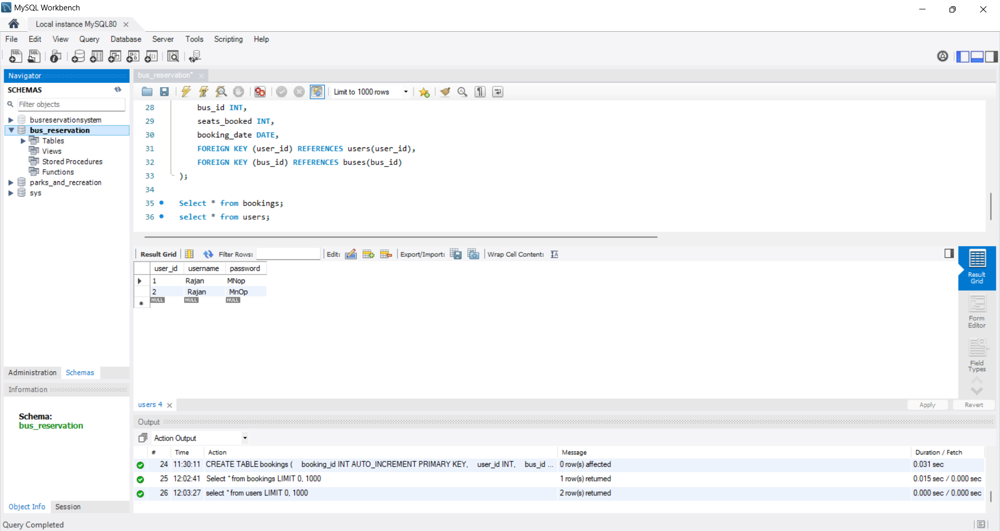

# Bus Reservation System

## Overview

The Bus Reservation System is a Java-based application that allows users to register, log in, view available buses, make bookings, and view their booking history. The system is designed with a MySQL database to manage users, buses, and bookings efficiently.

## Features

- **User Registration**: Register new users with a username and password.
- **User Login**: Authenticate users to access the system.
- **Add Bus**: Admins can add new buses to the system.
- **View Buses**: Users can view available buses and their details.
- **Make Booking**: Users can book seats on available buses.
- **View Bookings**: Users can view their booking history.

## Database Setup

1. **Create Database and Tables**
2. **Java Classes**
- **User**: Represents a user in the system.
- **Bus**: Represents a bus in the system.
- **Booking**: Represents a booking made by a user.
- **UserManager**: Handles user registration and login operations.
- **BusManager**: Manages bus-related operations like adding new buses and retrieving bus information.
- **BookingManager**: Handles booking operations including making and retrieving bookings.
- **DatabaseConnection**: Ensure you have a class DatabaseConnection that handles the connection to your MySQL database.
- **BusReservationSystem**: Compile all Java files and run the BusReservationSystem class.

## Output

